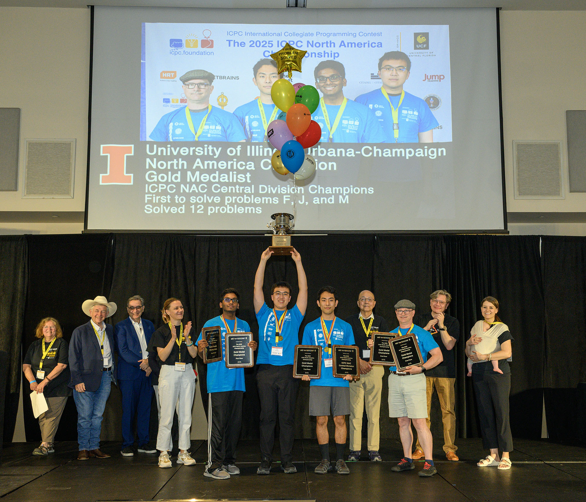

This year, UIUC student team Ippatsu—**Yuuki Sawanoi, Dilhan Salgado, and Zhikun Wang**—has been crowned **ICPC North America Champions**! 

They solved 12/13 problems, placing them 1st place out of 52 of the best teams among the best schools across across North America, winning the Gold medal. Alongside this, they were the first team to solve 3 different problems, and the 1st place champions of the North America Central Division.

They proceeded onto the ICPC World finals in Baku, securing 20th out of 139 teams. They solved 8/12 problems, going against some the best teams across in the entire world, representing over 103 countries. Alongside this, they were the first team to solve problem F. 

Both coaches Professor **Mattox Beckman** and PhD student **David Zheng**, were also awarded at the ICPC World Finals, in recongition of 5+ years of ICPC coaching.

