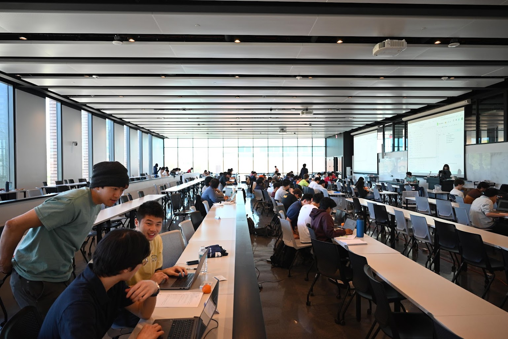
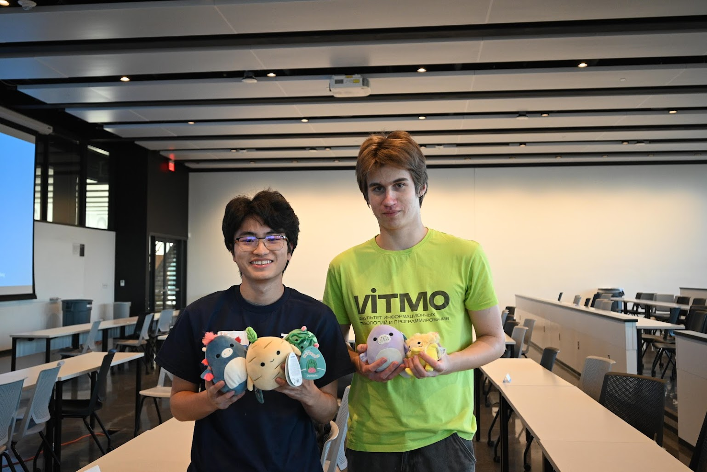

The Illinois Programming League (IPL) was series of weekly algorithmic programming contests held at UIUC, hosted by students during 2018-2022. Now it's back and better than ever!

This year's IPL featured a problem set of 20+ original problems written by UIUC current students and alumni *Yuuki Sawanoi, Dilhan Salgado, Franklin Zhang,* and *Ruzhang Yang*. The IPL also had two divisions, a beginners and experienced division, being an event welcoming all skills.

Over 80+ contestants from UIUC, Illinois Institute of Technology, and Purdue University showed up to compete at IPL this spring, and we hope to host this event again next year. 

We also would like to thank our sponsors here: Hudson River Trading, Chicago Trading Company, and MathWorks for supporting this event.

